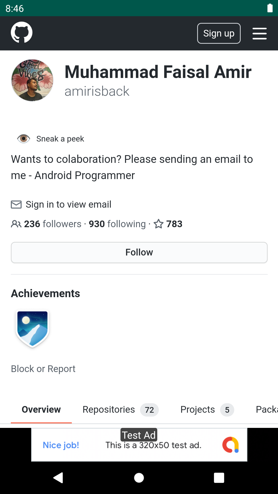
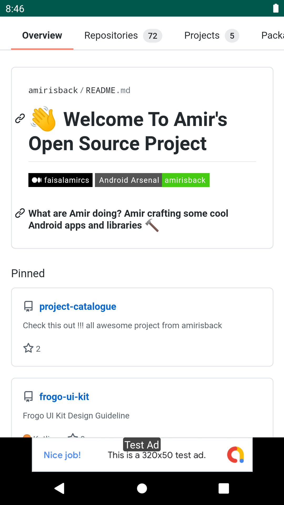
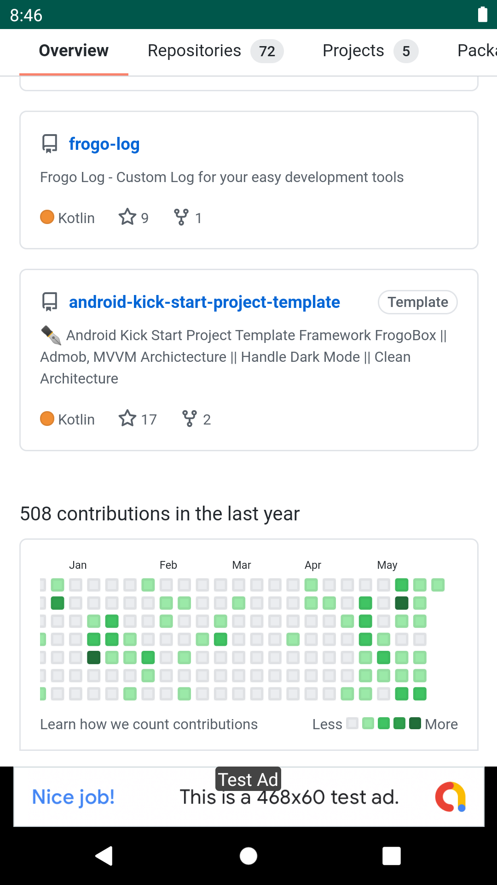

## WebView
- Apps for your website
- Contains Admob Implementation (Banner And Insterstitial)
- Easy To Reskin

## ScreenShot Apps
|                       ScreenShoot Apps                       |                       ScreenShoot Apps                       |                       ScreenShoot Apps                       |
|:------------------------------------------------------------:|:------------------------------------------------------------:|:------------------------------------------------------------:|
|  |  |  |

## Version Release

    $version_release = 2.0.1

What's New??

    * New Libs to Latest Version *
    * Can Back Inside Website *

## How To Use / Implement This Project

### Step 1. Setup Change Project Name APP
- Change Project Name

### Step 2. Setup Package Name / APP ID
- Change Package Name

### Step 3. Setup KeyStore
- Change keystore path and password
- Adding keystore in folder app

### Step 4. Setup Admob
- Change Admob ID for release

### Step 5. Setup Link URL
- Change Link URL for your website app

### Step 6. Setup Build Variant
- Change Build Variant to release for upload to playstore

### Step 7. Generate Signed AAB
- Build -> Bundle(s) / APK(s) -> Build Bundle(s)

### Step 8. Output AAB
- Output AAB ready for upload to playstore

## How to build from github
- For detail please visit [this repository](https://github.com/amirisback/automated-build-android-app-with-github-action)

### Step 1. Chose tab "Action"

### Step 2. Chose workflow "Android CI Generated Artifact"

### Step 3. Chose run workflow

### Step 4. Waiting for build and download artifact

### Step 5. Download artifact

### Step 6. Extract artifact

### Step 7. Output AAB

## Extras

### Setup Toggle Flag for Enable Ad

## Library
- frogo-admob [Click Here](https://github.com/amirisback/frogo-admob)
- frogo-log [Click Here](https://github.com/amirisback/frogo-log)

## Colaborator
Very open to anyone, I'll write your name under this, please contribute by sending an email to me

- Mail To faisalamircs@gmail.com
- Subject : Github _ [Github-Username-Account] _ [Language] _ [Repository-Name]
- Example : Github_amirisback_kotlin_admob-helper-implementation

Name Of Contribute
- Muhammad Faisal Amir
- Waiting List
- Waiting List

Waiting for your contribute

## Source
- Google Sample Code [Click Here](https://github.com/googleads/googleads-mobile-android-examples)
- Test Ads [Click Here](https://developers.google.com/admob/android/test-ads)
- For Get Started [Click Here](https://developers.google.com/admob/android/quick-start)

## Attention !!!
Please enjoy and don't forget fork and give a star
- Don't Forget Follow My Github Account

